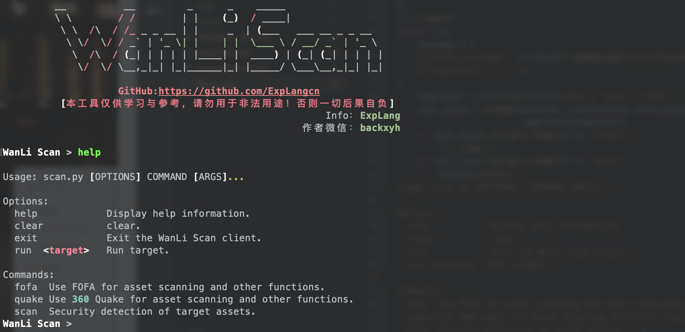
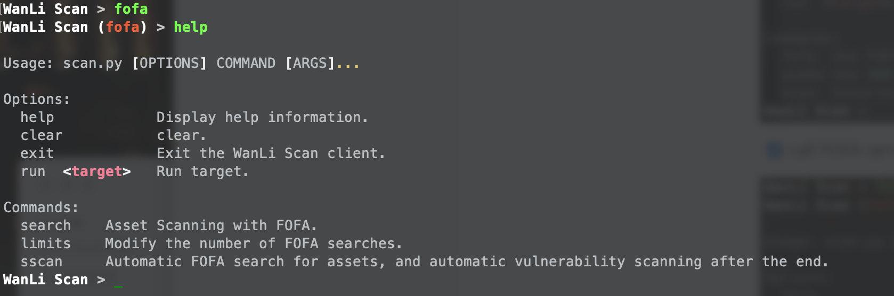
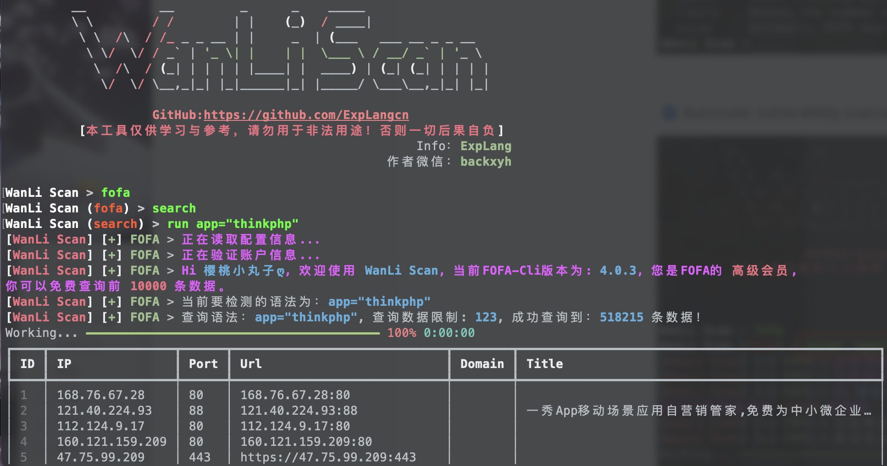
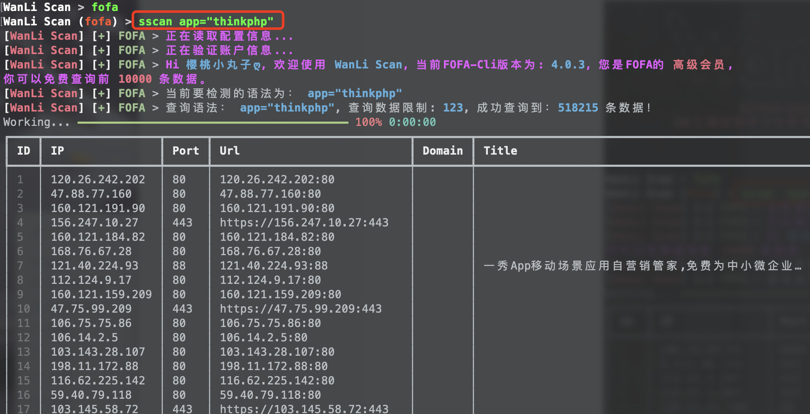
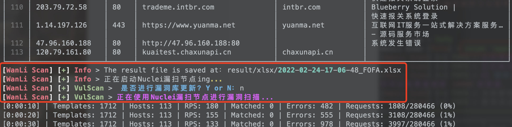
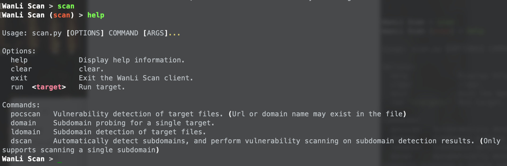
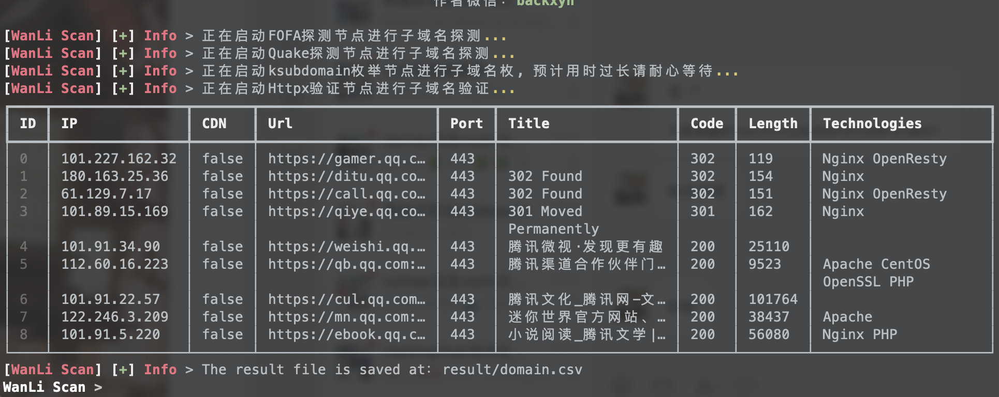
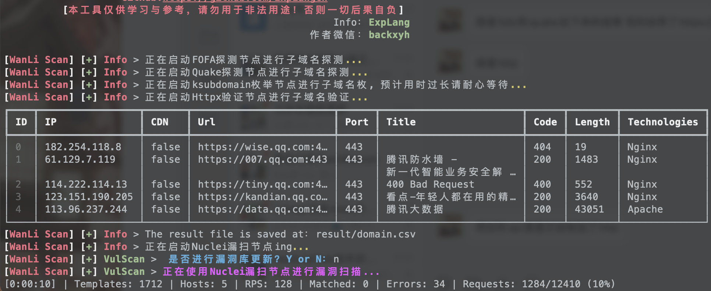
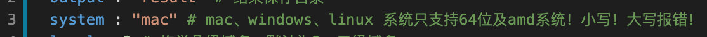

# WanLi Scan

**[中文说明](README_CN.md)** ｜ **[LICENSE](LICENSE)**｜**[Help](https://github.com/ExpLangcn/WanLi/wiki)**
----

It is convenient for red team personnel to conduct security detection on the target site and quickly obtain assets.

* Asset search detection using FOFA
* Asset search detection using 360 Quake
* Use Ksubdomain for domain fuzzing
* Use Httpx for domain name information detection
* Exploitation and detection using Nuclei
* Daily automatic update of vulnerability library

# 粉丝群


# Function



- [x] call FOFA service for asset detection





- [x] Automatic vulnerability scanning for FOFA asset detection results





- [x] Call Quake service for asset detection

Like the FOFA effect, Quake is currently being updated and upgraded, so let's not post the screenshot of the effect.

- [x] Automatic vulnerability scanning for Quake asset detection results

Like the FOFA effect, Quake is currently being updated and upgraded, so let's not post the screenshot of the effect.

- [x] Subdomain detection on target





- [x] Automatic vulnerability scanning for subdomain detection results



- [x] The program adapts to Windows, Macos, Linux systems

Configure `system` on the third line of the `config/config.yaml` file



- [x] Interactive control usage


- [ ] Call HUNTER service for asset detection
- [ ] Vulnerability scan on HUNTER asset detection results
- [ ] Call ARL for asset detection
- [ ] Vulnerability scan on ARL asset results
- [ ] Develop WEB visual interface

# use

````
git clone https://github.com/ExpLangcn/WanLi.git
cd WanLi & pip3 install -r requirements.txt
vim config/config.yaml # Configure FOFA information and Quake information
````

**[Help](https://github.com/ExpLangcn/WanLi/wiki)**

````
python3 WanLi.py # Enter interactive mode and enter Help to view help information
````

# update log

````
2022.2.24:
- Adapt to Windows system
- Restore interactive control, remove parameter control
- Optimize the overall code to improve efficiency
2022.2.21:
    - config problem report error solution, more suitable for Windows system
    - Removed the Domain scan function of FOFA and Quake and merged it into the Domain parameter
    - Improve the vulnerability scanning function, the vulnerability database will be updated before each vulnerability scan
    - replace the pocscan parameter with the poc parameter
    - To perform vulnerability scanning on Domain results and asset detection results, just add -scan
2022.2.16:
    - Refactor to rewrite WanLiScan
    - Fixed FOFA asset search issue
    - Added FOFA domain name detection
    - Added 360 Quake asset search
    - Added 360 Quake domain name detection
    -Added comprehensive domain name fuzz detection
    - Added vulnerability library single target vulnerability scanning function
    - Added vulnerability library batch target vulnerability scanning function
2022.2.8:
    - Update Docker version

2022.2.x:
    - I forgot the time...
````

# BiLiBiLi

**[RedCodeTm](https://space.bilibili.com/392628031)**

# twitter

**[@ExpLang_Cn](https://twitter.com/ExpLang_Cn)**

# Knowledge Planet Introduction:

[**One-time payment, permanent free**, you can join for free if you contact the operation when it expires]

Planet-oriented groups: mainly for information security researchers.

Update cycle: Update every two days at the latest.

Content direction: `Original security tools` | `Security development` | `WEB security` | `Intranet penetration` | `Bypass` | `Code audit` | `CTF` | `Share` ｜`Latest Vulnerabilities`｜`Security Information`


# We chat number


# Info

* **[ksubdomain](https://github.com/boy-hack/ksubdomain)**

* **[httpx](https://github.com/projectdiscovery/httpx)**

* **[nuclei](https://github.com/projectdiscovery/nuclei)**
