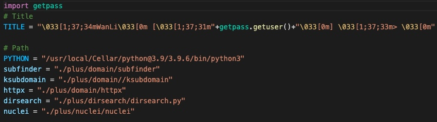

# WanLi

**[英文版](README.md)** ｜[LICENSE](LICENSE) ｜ **[WanLi-ExpLang](https://twitter.com/ExpLang_Cn)** ｜ **[帮助](https://github.com/ExpLangcn/WanLi/wiki/Help---%E5%B8%AE%E5%8A%A9)**


使用Dirsearch, Subfinder, Ksubdomain, Httpx、nuclei工具进行快速目标资产检查并对目标资产进行敏感文件、敏感路径、漏洞验证检测。

* 使用Dirsearch进行目录扫描
* 使用Subfinder进行子域名探测
* 使用Ksubdomain进行域名验证
* 使用Httpx进行域名信息探测
* 使用nuclei进行漏洞利用和检测

# 演示

[](https://asciinema.org/a/461330)

# 使用
```
git clone https://github.com/ExpLangcn/WanLi.git
cd WanLi & pip3 install -r requirements.txt
vim config/config.py
```

> 修改Path下的对应路径，除了python路径其他需要加"./"



```
python3 WanLi.py
```

# 帮助

```
clear                 清空屏幕                                                                        
ddir                  扫描单个主域名的相关域名及子域名的敏感文件及敏感地址，ddir baidu.com            
dirscan               扫描单个Web应用敏感文件及敏感地址，dirscan https://www.baidu.com/               
domain                扫描单个主域名的相关域名及子域名，domain baidu.com                              
exit                  退出工具                                                                        
help                  List available commands or provide detailed help for a specific command         
pocscan               扫描单个或多个WEB应用漏洞，可指定漏洞或批量漏洞，批量漏洞请使用“*.yaml”
```
# Twitter

[@ExpLang_Cn](https://twitter.com/ExpLang_Cn)

### 微信号


# Info

* **[ksubdomain](https://github.com/knownsec/ksubdomain)**

* **[dirsearch](https://github.com/maurosoria/dirsearch)**

* **[subfinder](https://github.com/projectdiscovery/subfinder)**

* **[httpx](https://github.com/projectdiscovery/httpx)**

* **[nuclei](https://github.com/projectdiscovery/nuclei)**
