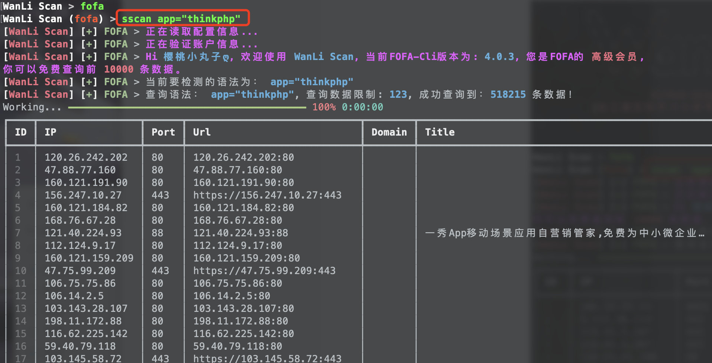

# WanLi Scan

**[英文说明](README.md)** ｜ **[LICENSE](LICENSE)** ｜ **[加入Discord](https://discord.gg/GCZzJmzW3G)** ｜ **[帮助](https://github.com/ExpLangcn/WanLi/wiki)**
----

方便红队人员对目标站点进行安全检测，快速获取资产。

* 使用FOFA进行资产搜索探测
* 使用360 Quake进行资产搜索探测
* 使用Ksubdomain进行域名Fuzz
* 使用Httpx进行域名信息探测
* 使用Nuclei进行漏洞利用和检测
* 每日自动更新漏洞库

# 功能


- [x] 调用FOFA服务进行资产探测


- [x] 对FOFA资产探测结果自动进行漏洞扫描




- [x] 调用Quake服务进行资产探测

和FOFA效果一样，目前Quake正在更新升级，所以先不放效果截图.

- [x] 对Quake资产探测结果自动进行漏洞扫描

和FOFA效果一样，目前Quake正在更新升级，所以先不放效果截图.

- [x] 对目标进行子域名探测


- [x] 对子域名探测结果自动进行漏洞扫描


- [x] 程序适配Windows、Macos、Linux系统

配置`config/config.yaml`文件的第三行的`system`


- [x] 交互式控制使用


- [ ] 调用HUNTER服务进行资产探测
- [ ] 对HUNTER资产探测结果进行漏洞扫描
- [ ] 调用ARL进行资产探测
- [ ] 对ARL资产结果进行漏洞扫描
- [ ] 开发WEB可视化界面

# 使用

```
git clone https://github.com/ExpLangcn/WanLi.git
cd WanLi & pip3 install -r requirements.txt
vim config/config.yaml # 配置FOFA信息及Quake信
```

**[Help](https://github.com/ExpLangcn/WanLi/wiki)**

```
python3 WanLi.py # 进入交互模式 输入Help查看帮助信息
```

# 更新日志

```
2022.2.24:
    - 适配Windows系统
    - 恢复交互式控制，去除参数控制
    - 优化整体代码提高效率
2022.2.21:
    - config问题报错解决 更加适配Windows系统
    - 剔除FOFA和Quake的Domain扫描功能，合并到Domain参数
    - 完善漏洞扫描功能，每次漏洞扫描前会进行漏洞库更新
    - pocscan参数更换为poc参数
    - 对Domain结果和资产探测结果进行漏洞扫描，只需要加入 -scan 即可
2022.2.16:
    -重构重写WanLiScan
    -修复FOFA资产搜索问题
    -新增FOFA域名探测
    -新增360 Quake资产搜索
    -新增360 Quake域名探测
    -新增综合性域名Fuzz探测
    -新增漏洞库单个目标漏洞扫描功能
    -新增漏洞库批量目标漏洞扫描功能
2022.2.8:
    -更新Docker版本

2022.2.x:
    -我忘了时间了...
```

#### 😄 I’m ExpLang [**Twitter**](https://twitter.com/ExpLang_Cn) 欢迎关注fo～


# 微信号


# Info

* **[ksubdomain](https://github.com/boy-hack/ksubdomain)**

* **[httpx](https://github.com/projectdiscovery/httpx)**

* **[nuclei](https://github.com/projectdiscovery/nuclei)**
